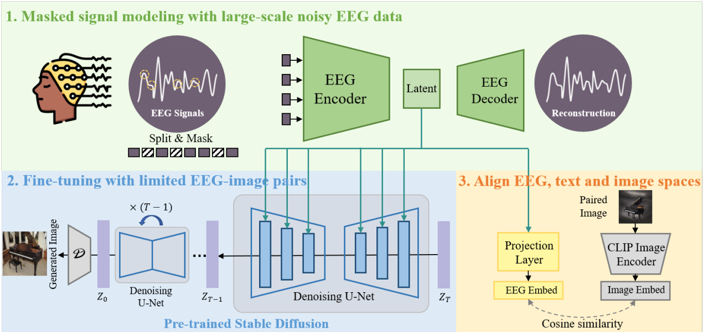

# DreamDiffusion: Generating High-Quality Images from Brain EEG Signals

*   Paolo Caruso 1843152 
*   Cristian Fioravanti 1861593

The objective of this project is to reproduce and reimplement the work carried out by the authors of the "<b>DreamDiffusion</b>" (https://arxiv.org/pdf/2306.16934.pdf) paper, exploring the key steps of the proposed algorithm and providing a practical and accessible version for the generation of images starting from EEG signals.

The structure of the proposed method is presented here: 

Our implementation is composed by three different sections:
1. Masked signal pre-training for effective and robust EEG representations: in which  masked signal are leveraged modeling with lots of noisy EEG data to train an EEG encoder to extract contextual knowledge.
2. Fine-tuning with limited EEG-image pairs with pre-trained Stable Diffusion and aligning the EEG, text, and image spaces using CLIP encoders: in which the resulting EEG encoder is then employed to provide conditional features for Stable Diffusion via the cross-attention mechanism aligning EEG, text, and image embedding spaces by reducing the distance between EEG embeddings and CLIP image embeddings during fine-tuning.
3. Image generation: image are generated from test EEG data using the model.

## Datasets
* A large amounts of [EEG data](https://tinyurl.com/eeg-visual-classification) used to pre-training in order to achieve an efficient Masked AutoEncoder.
* A set of [EEG-image pairs](https://tinyurl.com/eeg-visual-classification) used to accurately align the EEG features with existing text embedding. These EEG are obtained from some subjects while they were shown 2000 images belonging to 40 different categories of objects from the ImageNet
dataset.
* A subset of [ImageNet](https://drive.google.com/file/d/1y7I9bG1zKYqBM94odcox_eQjnP9HGo9-/view?usp=drive_link) containing the images showed to subsets.

## Environment setup
Create and activate conda environment named ```dreamdiffusion``` using ```python 3.8.5``` and install needed modules
```sh
conda create --name dreamdiffusion python=3.8.5
conda activate dreamdiffusion
pip install -r requirements.txt
```

## Masked signal pre-training for effective and robust EEG representations

To perform the pre-training with default parameters, run 
```sh
python code/1-pretrain.py
``` 
Hyper-parameters can be changed with command line arguments,
```sh
python code/1-pretrain.py --mask_ratio 0.75 --num_epoch 800 --batch_size 2
```

## Fine-tuning with limited EEG-image pairs with pre-trained Stable Diffusion and allignment of EEG, text, and image spaces using CLIP encoders

Once the previous step is finished, place the generated model's checkpoint into the path ```pretrains/eeg_pretrain/```. You can find the generated model's checkpoint in ```results/eeg_pretrain/<date-of-execution>``` folder

To perform this step, run
```sh
python3 code/2-finetune.py --num_epoch 300 --batch_size 4 --pretrain_mbm_path pretrains/eeg_pretrain/checkpoint.pth
```

## Image generation

Once the previous step is finished, place and rename the generated model's checkpoint into the path ```exps/results/generation/checkpoint_epoch.pth```. You can find the generated model's checkpoint in ```results/generation/<date-of-execution>``` folder

To perform this step, run
```sh
python3 code/3-generation.py
```

The generated images can be found in the folder ```exps/results/generation/<date-of-execution>```